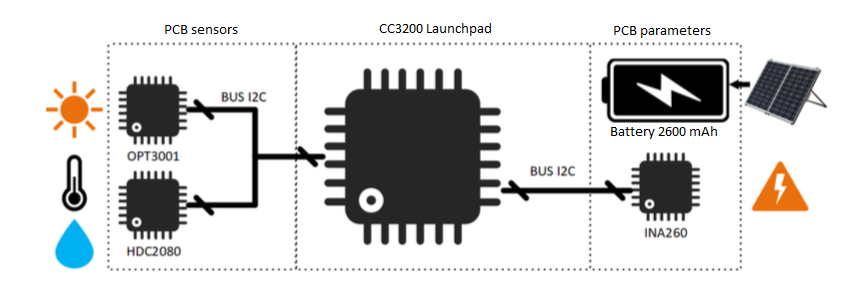

# Description

This public repository contains datasets, preprocessing scripts, and supplementary materials associated with the article titled "Predictive Modeling of Photovoltaic Panel Power Production through On-Site Environmental and Electrical Measurements Using Artificial Neural Networks." The datasets provide insights into the performance of PV panels under various conditions and are crucial for the development of predictive models.

This `readme.md` file provides step-by-step guidance on how to use the provided data and scripts. Researchers and developers can use this data to replicate the study, develop their predictive models, or conduct further analyses.


# Contents

1. **Raw Data Files**:
    - `med.csv`: Power production data of the PV panel over 15 days that includes lighting, temperature, and humidity environmental measurements logged every 5 minutes.
2. **Preprocessed Data**:
    - `med_discri.csv`: Power production data of the PV panel over 15 days **without night measurements** that includes lighting, temperature, and humidity environmental measurements logged every 5 minutes. 
    - `data_plots.csv`: Data of 1000 instances for plotting, correlation, and modeling process; instances used in the published paper.

3. **Scripts and Notebooks**:
	- Will be included soon. 

## Files structure
The structure of each `csv` file is similar and is shown below:

```
luxes, temp, hum, curr, volt, power, dd,hh,mm
3133.44,18,79,0.07,14.69,1.09,28,15,17
5765.12,18,76,0.14,14.73,1.98,28,15,12
5575.68,18,77,0.13,14.73,1.93,28,15,7
5506.56,18,77,0.13,14.72,1.93,28,15,2
5931.52,19,74,0.14,14.73,2.01,28,14,57
5565.44,18,75,0.13,14.72,1.92,28,14,52
6051.84,18,80,0.14,14.73,2.11,28,14,47
3304.96,17,78,0.08,14.69,1.18,28,14,42
2769.92,18,77,0.07,14.69,0.99,28,14,37
5309.44,19,76,0.12,14.73,1.82,28,14,32
8555.52,19,75,0.2,14.77,2.97,28,14,27
```

The columns are arranged as follows: 
- `luxes`: lighting measurements in luxes [lx] obtained in the same PV's angle.
- `temp`: temperature measurements in degrees Celsius [C] at the PV's structure.
- `hum`: relative humidity in [%RH] at the PV's structure.
- `curre`: current measurements in Amperes [A] measured at the PV's electrical output.
- `volt`: voltage measurements in volts [V] measured at the PV's electrical output.
- power: computed electrical power in Watts [S] obtained by multiplying the voltage and current measured.
- `dd`: two-digit format for day-of-month identification.
- `hh`: two-digit format for hour of day identification.
- `mm`: two-digit format for minutes of day identification.

**More detail about the collected data can be consulted in the published paper.**



**Citation:** Users of this dataset are required to cite the associated article and provide appropriate acknowledgment.  **included info soon**

